# Stool Microbiome Illumina WGS Analysis Pipeline

## Project Overview

This repository documents a comprehensive whole-genome sequencing (WGS) analysis pipeline for studying stool microbiome composition in children under 5 years of age. The pipeline is designed to compare microbial communities between **diarrhea cases** and **healthy controls**, providing insights into gut dysbiosis associated with pediatric diarrheal disease.

### Study Design

- **Target Population**: Children under 5 years of age
- **Study Groups**: 
  - Diarrhea cases (symptomatic children with acute or persistent diarrhea)
  - Healthy controls (age-matched children without gastrointestinal symptoms)
- **Sample Type**: Stool specimens
- **Clinical Metadata Collected**:
  - Age (months)
  - Sex
  - Antibiotic exposure (recent or current use)
  - Collection site/location
  - Collection date
  - Disease severity (for cases)

### Sequencing Specifications

- **Platform**: Illumina NovaSeq 6000
- **Read Type**: Paired-end sequencing
- **Sequencing Depth**: ~5 Gigabase pairs (Gbp) per sample
- **Read Length**: Typically 150 bp × 2 (paired-end)
- **Output Format**: FASTQ files (R1 and R2)
- **Coverage**: Deep shotgun metagenomics for comprehensive taxonomic profiling

---

## Pipeline Workflow

### Text Version

```
Cohort design (<5 years): Diarrhea cases vs Healthy controls
            ↓
Stool collection + clinical metadata (age, sex, antibiotics, site, date)
            ↓
DNA extraction → Illumina NovaSeq WGS (~5 Gbp/sample; paired-end FASTQ)
            ↓
Linux QC: FastQC → MultiQC → trimming/filtering (fastp/cutadapt)
            ↓
Human read removal (bowtie2 / kneaddata)  [stool; privacy + accuracy]
            ↓
Taxonomic profiling: Kraken2 (classification) - bacteria only
            ↓
Abundance estimation: Bracken (phylum→class→order→family→genus→species)
            ↓
Create feature tables: taxa abundance matrices + metadata
            ↓
R analysis (by taxonomic level)
  - Normalization (relative abundance + optional CLR)
  - Diversity (α, β), ordination (PCoA/NMDS), PERMANOVA
  - Differential abundance (ANCOM-BC), adjust covariates (age, antibiotic use)
            ↓
Visualization & reporting
  - Stacked barplots (phylum/genus), heatmaps, ordination plots
  - Volcano/forest plots of differential taxa (species-level)
  - Reproducible report (Quarto/RMarkdown)
```

### Visual Workflow Diagram

The complete pipeline is visualized using Mermaid flowchart notation. See the full diagram below or in [`workflow_diagram.mmd`](workflow_diagram.mmd).

```mermaid
%% Stool Microbiome Illumina WGS Analysis Pipeline
%% Target: Children <5 years (Diarrhea vs Healthy controls)

graph TD
    A[Cohort Design<br/>Children <5 years<br/>Diarrhea cases vs Healthy controls] --> B[Stool Collection +<br/>Clinical Metadata<br/>age, sex, antibiotics, site, date]
    B --> C[DNA Extraction]
    C --> D[Illumina NovaSeq WGS<br/>~5 Gbp/sample<br/>Paired-end FASTQ]
    
    D --> E[Quality Control - Linux]
    E --> F[FastQC<br/>Quality assessment]
    F --> G[MultiQC<br/>Aggregate QC reports]
    G --> H[Read Trimming/Filtering<br/>fastp or cutadapt]
    
    H --> I[Human Read Removal<br/>bowtie2 or kneaddata<br/>Privacy + Accuracy]
    
    I --> J[Taxonomic Profiling - Linux]
    J --> K[Kraken2<br/>Taxonomic classification<br/>Bacteria only]
    K --> L[Bracken<br/>Abundance estimation<br/>phylum → class → order<br/>→ family → genus → species]
    
    L --> M[Feature Tables Generation<br/>Taxa abundance matrices +<br/>Metadata integration]
    
    M --> N[Statistical Analysis - R]
    N --> O[Normalization<br/>Relative abundance +<br/>optional CLR transformation]
    O --> P[Diversity Analysis<br/>α-diversity Shannon, Simpson<br/>β-diversity Bray-Curtis, UniFrac]
    P --> Q[Ordination + Testing<br/>PCoA/NMDS visualization<br/>PERMANOVA significance testing]
    Q --> R[Differential Abundance<br/>ANCOM-BC analysis<br/>Adjust for age, antibiotic use]
    
    R --> S[Visualization & Reporting]
    S --> T[Generate Plots<br/>Stacked barplots phylum/genus<br/>Heatmaps, ordination plots<br/>Volcano/forest plots species-level]
    T --> U[Reproducible Report<br/>Quarto or RMarkdown<br/>Final documentation]
    
    style A fill:#e1f5ff,stroke:#0288d1,stroke-width:3px
    style D fill:#fff3e0,stroke:#f57c00,stroke-width:2px
    style I fill:#f3e5f5,stroke:#7b1fa2,stroke-width:2px
    style K fill:#e8f5e9,stroke:#388e3c,stroke-width:2px
    style L fill:#e8f5e9,stroke:#388e3c,stroke-width:2px
    style O fill:#ffe0b2,stroke:#e64a19,stroke-width:2px
    style R fill:#ffe0b2,stroke:#e64a19,stroke-width:2px
    style U fill:#c8e6c9,stroke:#2e7d32,stroke-width:3px
```



---

## Detailed Pipeline Stages

### 1. Quality Control (Linux)
- **FastQC**: Assess raw read quality, identify adapter contamination
- **MultiQC**: Aggregate QC reports across all samples
- **fastp/cutadapt**: Trim adapters, filter low-quality reads, remove short reads

### 2. Host Decontamination (Linux)
- **bowtie2** or **kneaddata**: Align reads to human reference genome (GRCh38)
- Remove human reads to:
  - Protect patient privacy
  - Improve taxonomic classification accuracy
  - Reduce computational burden

### 3. Taxonomic Profiling (Linux)
- **Kraken2**: Ultra-fast k-mer based taxonomic classification
  - Focus on bacterial taxa (archaea/viruses optional)
  - Classify reads to lowest taxonomic level possible
- **Bracken**: Bayesian abundance re-estimation
  - Correct for database biases
  - Estimate abundances from phylum to species level

### 4. Feature Table Generation (Linux/R)
- Convert Kraken2/Bracken outputs to abundance matrices
- Integrate clinical metadata with taxonomic tables
- Prepare data structures compatible with R phyloseq

### 5. Statistical Analysis (R)
- **Normalization**: Convert counts to relative abundances, apply CLR if needed
- **Alpha Diversity**: Within-sample diversity (Shannon index, Simpson index)
- **Beta Diversity**: Between-sample dissimilarity (Bray-Curtis, weighted/unweighted UniFrac)
- **Ordination**: PCoA (Principal Coordinates Analysis), NMDS (Non-metric Multidimensional Scaling)
- **Statistical Testing**: PERMANOVA for group differences
- **Differential Abundance**: ANCOM-BC to identify taxa differing between groups
  - Adjust for covariates: age, antibiotic use, collection site

### 6. Visualization & Reporting (R)
- **Composition plots**: Stacked barplots at phylum and genus levels
- **Heatmaps**: Hierarchical clustering of top taxa
- **Ordination plots**: PCoA/NMDS colored by disease status
- **Differential abundance plots**: Volcano plots, forest plots at species level
- **Reproducible reports**: Quarto or RMarkdown documents with embedded code

---

## Tools and Packages

A comprehensive table of all tools and packages used in this pipeline is available in [`tools_packages.md`](tools_packages.md).

### Quick Reference

#### Linux Tools
- **FastQC** (v0.11.9+): Quality assessment
- **MultiQC** (v1.14+): Aggregate QC reports
- **fastp** (v0.23.2+): Read trimming and filtering
- **cutadapt** (v4.1+): Alternative trimming tool
- **bowtie2** (v2.4.5+): Human read alignment/removal
- **kneaddata** (v0.12+): Integrated QC and decontamination
- **Kraken2** (v2.1.2+): Taxonomic classification
- **Bracken** (v2.7+): Abundance estimation

#### R Packages
- **phyloseq** (v1.42+): Microbiome data management and analysis
- **vegan** (v2.6+): Diversity analysis and ordination
- **ANCOMBC** (v2.0+): Differential abundance testing
- **tidyverse** (v2.0+): Data manipulation and visualization
- **ggplot2** (v3.4+): Advanced plotting
- **microbiome** (v1.20+): Microbiome-specific utilities
- **compositions** (v2.0+): CLR transformation
- **Quarto** or **RMarkdown**: Reproducible reporting

---

## Rendering the Mermaid Diagram

### Online Tools

1. **Mermaid Live Editor** (Recommended)
   - Visit: [https://mermaid.live/](https://mermaid.live/)
   - Copy the contents of `workflow_diagram.mmd` into the editor
   - The diagram renders in real-time
   - Export options: PNG, SVG, or edit the code directly

2. **GitHub/GitLab Native Rendering**
   - GitHub and GitLab automatically render Mermaid diagrams in Markdown files
   - This README should display the diagram automatically when viewed on GitHub

### Command-Line Tools

1. **Mermaid CLI** (mmdc)
   ```bash
   # Install
   npm install -g @mermaid-js/mermaid-cli
   
   # Render to PNG (high resolution)
   mmdc -i workflow_diagram.mmd -o workflow_diagram.png -w 2400 -H 3200
   
   # Render to SVG (vector, publication-ready)
   mmdc -i workflow_diagram.mmd -o workflow_diagram.svg
   ```

2. **Using Quarto/RMarkdown**
   - Mermaid diagrams are natively supported in Quarto and RMarkdown
   - Simply include the .mmd file or embed the code in a mermaid code block

### Integration with Publications

- Export as **SVG** for vector graphics (scalable, high quality)
- Export as **PNG** at 300+ DPI for raster graphics
- Edit colors/styling in the .mmd file before rendering
- Use Adobe Illustrator or Inkscape for final touch-ups if needed

---

## Key Resources

### Databases
- **Kraken2 Standard Database**: [AWS Indexes](https://benlangmead.github.io/aws-indexes/k2)
- **Human Reference Genome (GRCh38)**: [NCBI Genome](https://www.ncbi.nlm.nih.gov/genome/guide/human/)
- **RefSeq/NCBI Taxonomy**: [NCBI Taxonomy Browser](https://www.ncbi.nlm.nih.gov/Taxonomy/)

### Documentation & Tutorials
- **Kraken2 Manual**: [https://github.com/DerrickWood/kraken2/wiki](https://github.com/DerrickWood/kraken2/wiki)
- **Bracken Documentation**: [https://ccb.jhu.edu/software/bracken/](https://ccb.jhu.edu/software/bracken/)
- **phyloseq Tutorials**: [https://joey711.github.io/phyloseq/](https://joey711.github.io/phyloseq/)
- **ANCOM-BC Paper**: [Lin & Peddada, 2020, Nature Communications](https://www.nature.com/articles/s41467-020-17041-7)
- **Microbiome Analysis Workflow**: [F1000Research Workflow](https://f1000research.com/articles/5-1492)

### Best Practices & Guidelines
- **Human Microbiome Project**: [https://hmpdacc.org/](https://hmpdacc.org/)
- **STORM Checklist**: Strengthening The Organization and Reporting of Microbiome Studies
- **MIMARKS**: Minimum Information about a MARKer gene Sequence

---

## Repository Structure

```
.
├── README.md              # This file - comprehensive documentation
├── workflow_diagram.mmd   # Mermaid flowchart source code
└── tools_packages.md      # Detailed tools and packages reference
```

---

## Citation & Acknowledgments

If you use this pipeline or documentation in your research, please cite the relevant tools and databases:

- **Kraken2**: Wood, D.E., Lu, J. & Langmead, B. Improved metagenomic analysis with Kraken 2. Genome Biology 20, 257 (2019).
- **Bracken**: Lu, J., Breitwieser, F.P., Thielen, P. & Salzberg, S.L. Bracken: estimating species abundance in metagenomics data. PeerJ Computer Science 3:e104 (2017).
- **ANCOM-BC**: Lin, H. & Peddada, S.D. Analysis of compositions of microbiomes with bias correction. Nature Communications 11, 3514 (2020).
- **phyloseq**: McMurdie, P.J. & Holmes, S. phyloseq: An R package for reproducible interactive analysis and graphics of microbiome census data. PLoS ONE 8(4):e61217 (2013).

---

## License

This documentation is provided under the MIT License. Individual tools and packages maintain their own licenses.

---

## Contact & Support

For questions about this pipeline or suggestions for improvements, please open an issue in this repository.

**Last Updated**: February 2026